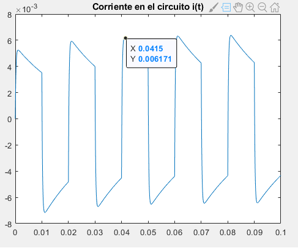
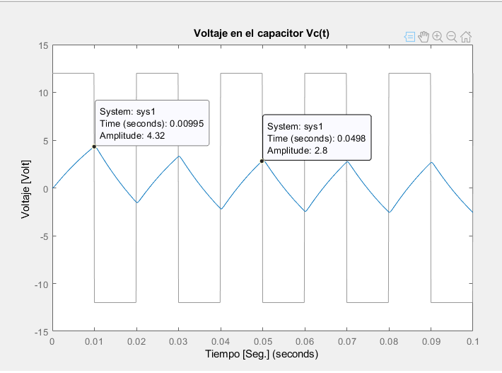

Ítem [1] Asignar valores a R=2200, L=500mHy, y C=10F. Obtener simulaciones que permitan
estudiar la dinámica del sistema, con una entrada de tensión escalón de 12V, que cada 10ms
cambia de signo.

clc;clear all;close all;

%Defino las contantes del sistema
R=2.2e3;
L=500e-3;
C=10e-6;

Defino las matrices
Mat_A=[-R/L -1/L;1/C 0];
Mat_B=[1/L;0];
Mat_C=[R 0;0 1];% Necesito el voltaje a la salida que es el producto entre la corriente de la malla y la resistencia

%Defino la entrada U

h = 1e-4;          % 0.1 ms
t = 0:h:0.1;       % 100 ms total
u = zeros(size(t));
variable=0;%cuenta 1ms/h

for i = 1:length(t)
    
    if variable < (0.01/h)     % 10 ms en +12
        u(i) = 12;
    else                       % 10 ms en -12
        u(i) = -12;
    end
    
    variable = variable + 1;
    
    if variable >= (0.02/h)    % periodo total 20 ms
        variable = 0;
    end
end
plot(t, u);
grid on;
title('u_t,V_a')
xlabel('Tiempo [Seg.]');
ylabel('Voltaje [Volt]');

%voltaje en el capacitor
Mat_C=[0 1];
sys1=ss(Mat_A,Mat_B,Mat_C,[]);
figure
lsim(sys1,u,t);
xlabel('Tiempo [Seg.]');
ylabel('Voltaje [Volt]');
title('Voltaje en el capacitor Vc(t)');

%corriente
Mat_C=[1 0];
sys2=ss(Mat_A,Mat_B,Mat_C,[]);
Corriente=lsim(sys2,u,t);
figure
plot(t,Corriente);
title('Corriente en el circuito i(t)');

